In this tutorial, you'll familiarize yourself with Node-RED, its nodes and its flow-based programming model. You'll learn how to extend Node-RED by installing additional nodes, work with external libraries from Node-RED nodes, and create dashboards. With this tutorial, you build an application that analyzes earthquake-related data along with weather data to understand when and where earthquakes are happening around the world.

[Node-RED](https://nodered.org/) is an open source visual flow-based programming tool used for wiring not only Internet of Things (IoT) components, but also integrating an ensemble of service APIs, including ones provided by IBM Cloud. A node in Node-RED performs a particular function, which typically minimizes the amount of coding that is needed to build a given application.  If you've never used Node-RED before, you might want to start out by reviewing this brief video tutorial, "[Creating your first Node-RED flow](/videos/creating-your-first-node-red-flow/)."

Because this tutorial explores the nodes and features of Node-RED, it might not present the optimal way of developing this application. Also, the development of the application was in a country or region where the purchase or usage of the [Weather Company Data](https://cloud.ibm.com/catalog/services/weather-company-data) for IBM Cloud service is not allowed.

In this tutorial, you will create a simplified Earthquake Monitoring System. The application has two main components:

* A web service is defined that used an external package that talks to RSOE EDIS Rest API to get info on all earthquakes happening within the last hour. The location name that corresponds to each earthquake point is then taken in order to extract the location coordinates (longitude & latitude) using GeoNames node. Based on the coordinates,  the current weather conditions are retrieved using an OpenWeatherMap.

* A dashboard that displays a world map. When the web service is called, the returned data is stored in a Cloudant database and also displayed on a map in the dashboard using the worldmap node. Three dashboard nodes are used here for displaying the points on the map, displaying the latest tweet on earthquakes happening along with a chart with the frequency of the earthquakes happening in each area.

So let's get started!

## Learning objectives

After you complete this tutorial, you will know how to:

* Create a Node-RED Starter application running on IBM Cloud.
* Install and work with nodes available in the [Node-RED Library](https://flows.nodered.org/).
* Make packages or modules available to a **function** node.
* Work with **Dashboard** nodes.
* Secure a Web API that was created in a Node-RED Starter application.

## Prerequisites

* Create an  [IBM Cloud](https://cloud.ibm.com) **lite** account, if you don't already have one.
* Create an account on [**OpenWeatherMap**](https://home.openweathermap.org) to retrieve an API key
* Create an account on [**GeoNames**](http://www.geonames.org/), and then [enable the account to use free web services](http://www.geonames.org/manageaccount)
* Create an account on [**Twitter**](https://twitter.com/) and [create a Twitter application](http://apps.twitter.com/)

## Estimated time

It will take about 2 hours to complete this tutorial including the prerequisites.

## 1 Create a Node-RED Starter Application

1. Log in to your [IBM Cloud](https://cloud.ibm.com) account.
1. Open the IBM Cloud [Catalog](https://cloud.ibm.com/catalog).
1. Select the [**Starter Kits**](https://cloud.ibm.com/catalog?category=starterkits) category, then click [**Node-RED Starter**](https://cloud.ibm.com/catalog/starters/node-red-starter).
1. Enter a unique name for the app. This name is also used as the hostname. If you are using a lite account, the Region, Organization, and Space fields are pre-populated with the appropriate values.
1. In the **Selected Plan** section, for the Cloudant database, choose the **Lite** option.
1. Click the **Create** button.

   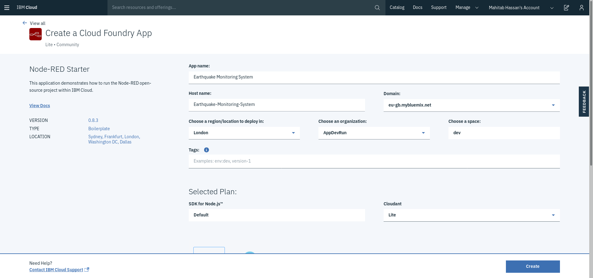

1. After the status of your application changes to `Running`, click **Visit App URL**.
1. Follow the directions to access the *Node-RED flow editor*. You are encouraged to secure your Node-RED flow editor to ensure that only authorized users can access it.

   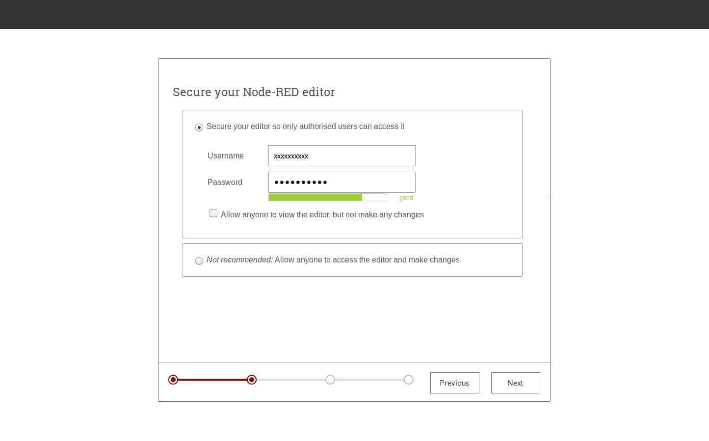

1. Click on **Go to your Node-RED flow editor**. A new flow called `Flow 1` is opened in the Node-RED flow editor. If you secured your Node-RED flow editor, you will first be asked to enter the **username** and **password** that you just set up.

## 2 Develop the Application

Our Earthquake Monitoring System application has two main components:

* The web service component
* The dashboard component

The steps to create these two components in our Node-RED app follow.  I encourage you to follow the steps to learn just how easy it is to create apps using Node-RED.

You can also import both of the flows explained in this tutorial. First, copy the contents of the [flows.json file](static/flows.json) to the clipboard. Then, go to the hamburger menu in your Node-RED editor, and select **Import > Clipboard**. Then, paste the contents into the dialog, and click **Import**. You'll still need to follow the steps in this tutorial to configure all the nodes and to make the packages and modules available to a **function** node.

### 2a Create the Web Service

1. Double-click the tab with the flow name, and call it `Earthquake Details`.
1. Click the hamburger menu, and then click **Manage palette**. Look for **node-red-node-openweathermap** and **node-red-contrib-geonames** to install these additional nodes in your palette.

   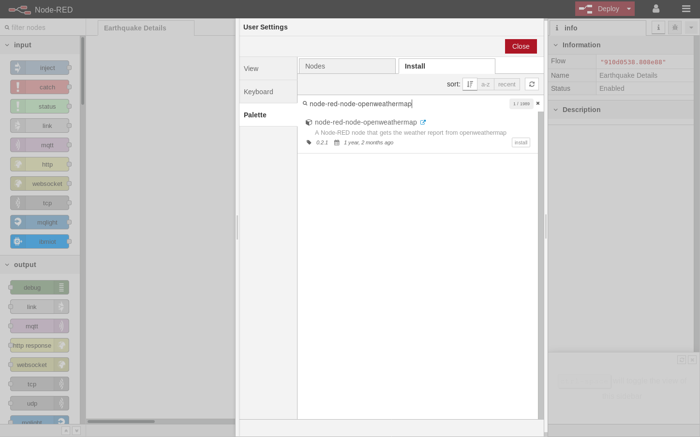

1. Add an **HTTP input** node to your flow.
1. Double-click the node to edit it. Set the method to `GET` and set the URL to ``/earthquakeinfo`.
1. Add an **HTTP response** node, and connect it to the previously added **HTTP input** node.
1. Add a **change** node.
1. Double-click the node to modify it. Name this node `Set Headers`. In the **Rules** section, specify that the message headers will be in JSON format by selecting `application/JSON` as their Content-Type. See the following image.

   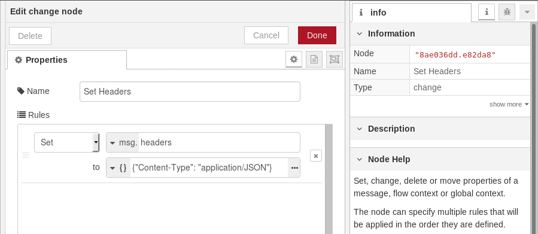

1. Click **Deploy**.

From this point on, you will add nodes between the **HTTP input** and **HTTP response** nodes.

<sidebar>A [toolchain](https://www.ibm.com/cloud/garage/toolchains) is a set of tool integrations that support development, deployment, and operations tasks. DevOps toolchains allows you to combine IBM Cloud services with open source and third-party tools to enable teams to align with your DevOps methodology. Learn more about [creating custom toolchains in this tutorial](/tutorials/custom-toolchain-with-devops/).</sidebar>

#### Adding the **rsoeedis** Package

Now, you need to make the [**rsoeedis**](https://www.npmjs.com/package/rsoeedis) package available to the **function** node, which will pull earthquake information from RSOE EDIS.

1. Go back to the IBM Cloud application that you created.
1. Click **Overview**.  In the **Continuous delivery** section, click **Enable**.

   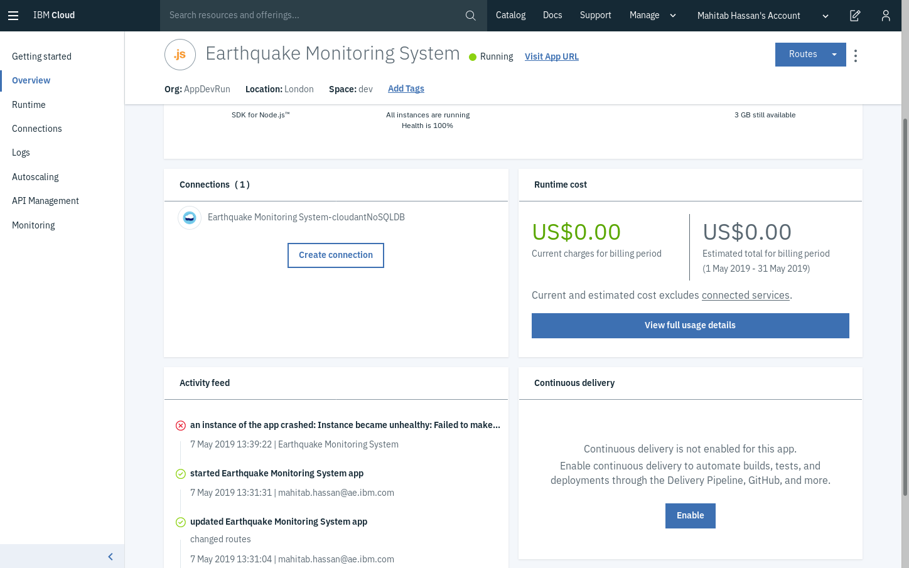

1. Confirm all the pre-populated details. Then, under **Tool Integrations**, select **Delivery Pipeline**, and then click **Create+** to generate an IBM Cloud API Key.
1. At the bottom of the page, click the **Create** button.

   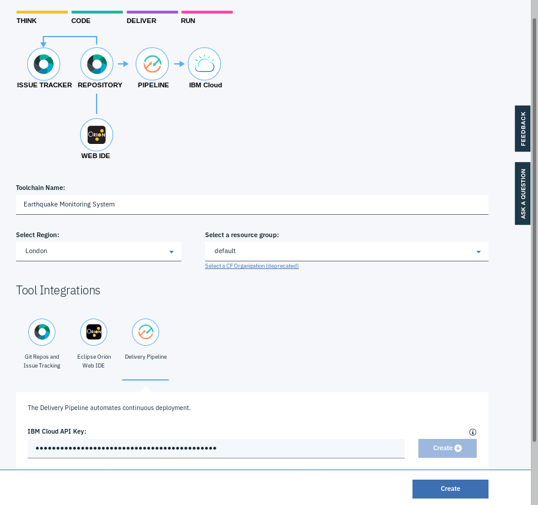

1. Now, you need to configure the files to make the rsoeedis package available to the **function** node.  In the Toolchains window, do one of the following steps:

    * Clone the repository from the **Git** action, and make the edits to the files locally.
    * Open the Eclipse Orion Web IDE to edit the files in the IBM Cloud.

   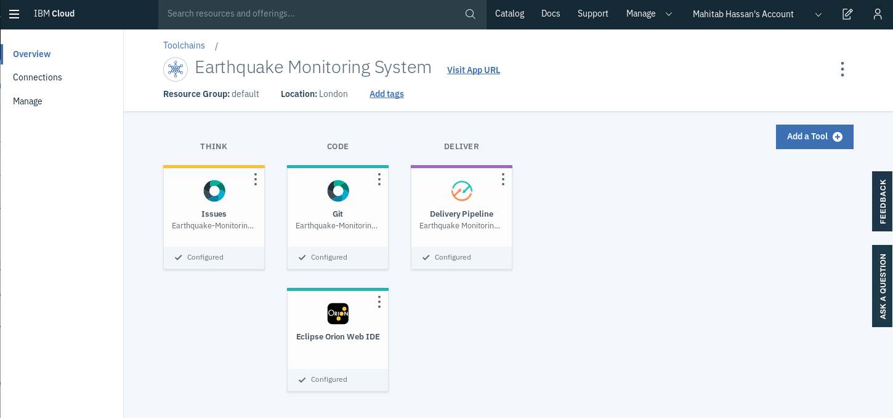

1. Edit the `bluemix-settings.js` file.

   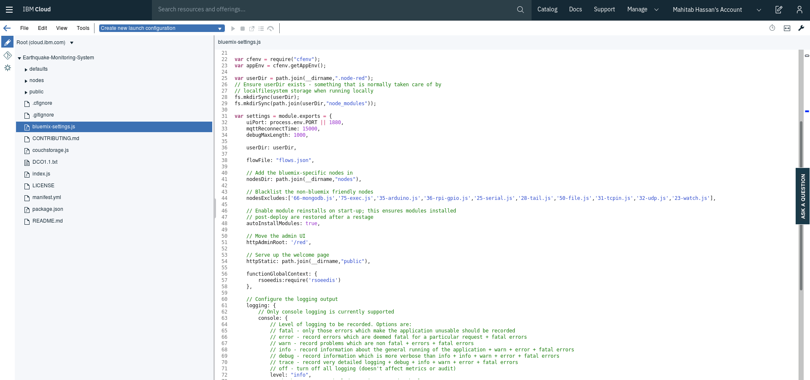

1. Find the definition of the `functionGlobalContext` object, and add `rsoeedis`.

    ```
    functionGlobalContext: {
        rsoeedis:require('rsoeedis')
    },
    ```

1. Edit the `package.json` file, and define `rsoeedis` as a dependency.

    ```
    "dependencies": {
        ...,
        "rsoeedis":"0.0.2"
    },
    ```

   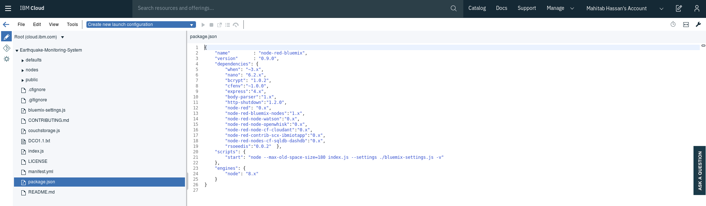

1. Use Git to commit and push all changes.

1. Go back to your application, and wait for your application to finish deploying. You can check that by looking at the **Delivery Pipeline** card.

   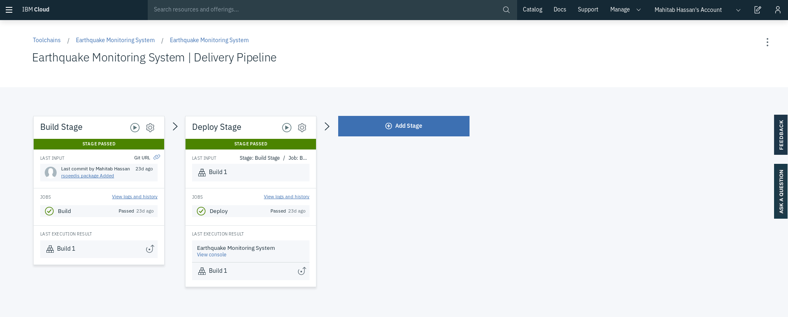

#### Finishing the Web Service

1. Open the Node-RED flow editor again to continue building your application.

1. Add a **function** node after the **change** node that you previously added.  Name the function node `Use rsoeedis`. Add the following javascript code to the node. Notice how `status`, `warn` and `error` are used.

    ```
    var rsoeedis = global.get('rsoeedis');

    const earthquakes = rsoeedis.RsoeEdisClient.earthquakes();

    earthquakes.then(result => {
        node.status({fill:"yellow",shape:"dot",text:"geting rsoeedis earthquakes info"});
        node.warn("rsoeedis earthquakes info retrieved");
        node.status({});   // to clear the status

        //function needs to perform an asynchronous action before sending a message
        //it cannot return the message at the end of the function
        node.send({payload:result,req:msg.req,res:msg.res});

    }).catch(error => {
        node.status({fill:"red",shape:"ring",text:"error"});
        node.error("Error!! ", error);
    });
    ```

1. Add a **change** node. Call this node `Set Earthquake Info`. Set the `msg.payload` to a `JSONata expression` as shown in the following code (JSONata is simply a querying language).

    ```
    payload.{
        "Type": Earthquake",
        "Continent":$replace(continent, " &amp;", ","),
        "Location": $join([location, state, country], ", "),
        "Magnitude": magnitude,
        "Radial Distance": $join([$string(
           $round($power(
            2.7182818284590452353602874713526624977572470936999595749669676277240766303535475945713821785251664274,
           magnitude / 1.01 - 0.13
            ),3)
        ), " km"]),
        "Source": source,
        "Event Date": eventDate
    }
    ```

1. Select the three previously added nodes, go to the hamburger menu, and click **Subflows > Create Subflow**. A new node is created that includes these conceptually related nodes that can now be used anywhere they are needed. Name this new node `rsoeedis_earthquake`.
1. Close the subflow. Add a **split** node, which will split the earthquake information points into different messages based on the location.
1. Add a **change** node that will extract the location name, which will be fed into the **search place** node of GeoNames (which we add next), which, in return, will provide the location's coordinates in terms of longitude and latitude. Call this node `Set GeoNames Query`.

   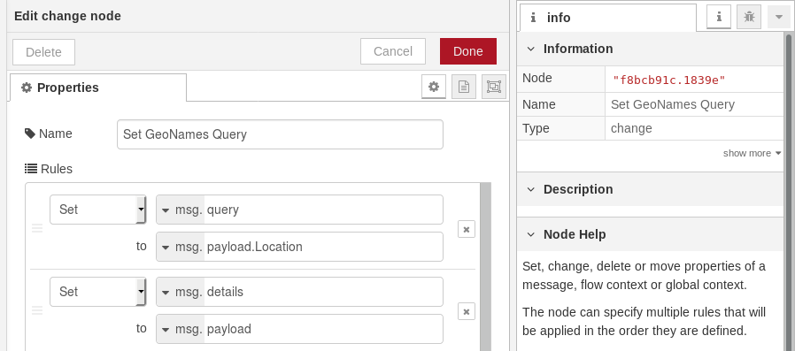

1. Add a **search place** node and modify it as follows. Add the **Username** based on the GeoNames account you created.

   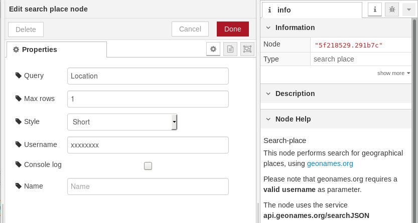

1. Add a **change** node to set the longitude and latitude to the right properties which will get fed into the **openweathermap** node. Name this node `Set Lon & Lat`.

   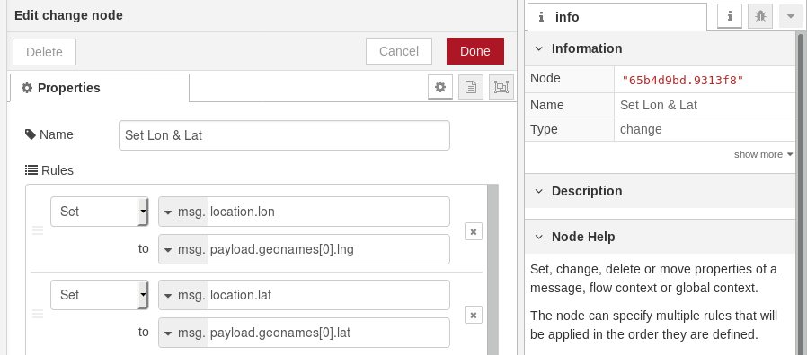

1. Add an **openwethermap** node to which you will be adding the API key from the [OpenWeatherMap site](https://home.openweathermap.org/api_keys). (Log in to the site with the account you created.)
1. Add another **change node** that will set the message payload to the output of a JSONata expression that will format the messages correctly. The JSONata expression is as follows.

    ```
    {
        "name": parts.index,
        "Continent":details.Continent,
        "Location":details.Location,
        "Magnitude":details.Magnitude,
        "Radial Distance":details."Radial Distance",
        "Source":details.Source,
        "Event Date":details."Event Date",
        "longitude": data.coord.lon,
        "latitude":data.coord.lat,
        "Type":details.Type,
        "Temperature":data.main.temp,
        "Pressure":data.main.pressure,
        "Humidity":data.main.humidity,
        "Wind Speed":data.wind.speed,
        "Wind Direction":data.wind.deg,
        "Cloud Coverage":data.clouds.all,
        "SIDC" : "EONPAC------",
        "command":{
            "heatmap": {
                "gradient": {
                    "0.1": "blue",
                    "0.3": "green",
                    "0.6": "orange",
                    "0.9": "red"
                }
            }
        }
    }
    ```

1. Add a **join** node to join the previous split message into a single one again, which will be returned when an HTTP request is submitted.
1. Add a **change** node to remove any redundant properties. Name this node `Remove Unnecessary Properties`.

   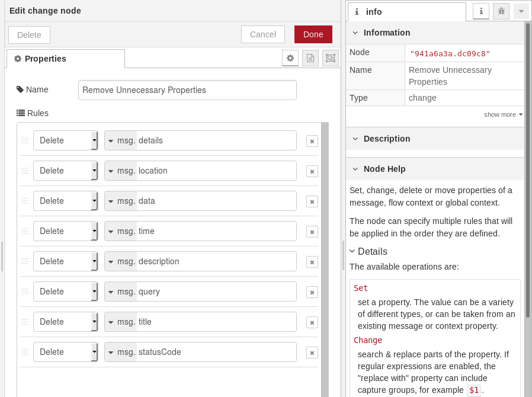

1. Clean up the flows by creating more subflows and using link nodes. Also, add **comment**, **error**, and **status** nodes, and your flow should look similar to the following flow.

   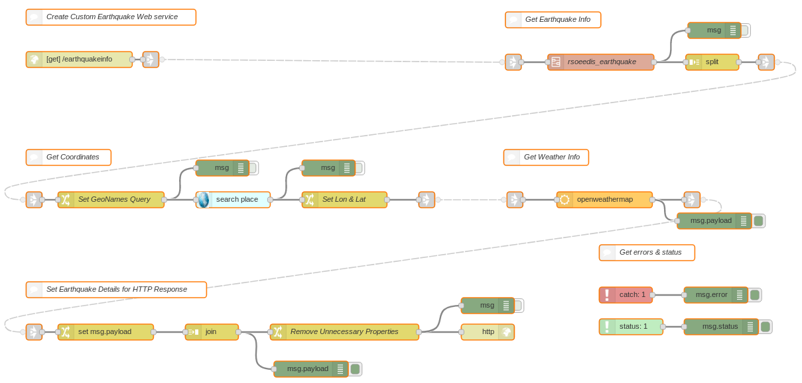

1. Click **Deploy** for all changes to take effect.

### 2b Creating the Dashboard

Now that you've created the Web service component, you can create the Dashboard component.

#### Group similar widgets together in your dashboard

1. Add a new flow, and name it `Dashboard`.
1. Go to **Manage palette**, and install the **node-red-contrib-web-worldmap** and **node-red-dashboard** packages. **node-red-contrib-web-worldmap** is used to create a map on which points corresponding to locations where earthquakes are taking place in the last 24 hours are plotted. **node-red-dashboard** is used to display the latest earthquake-related tweets and the frequency of earthquakes per area.
1. Go to the **Dashboard** tab that was added next to the **Node information** and **Debug messages** tabs. There are three sub-tabs: **Layout**, **Site** and **Theme**. Each of these sub-tabs is used to change the look and feel of the UI.
1. Under **Layout**, create a tab by clicking on **+tab**, which can resemble a page in the UI. Edit it as shown in the following image, and click **Update**.

   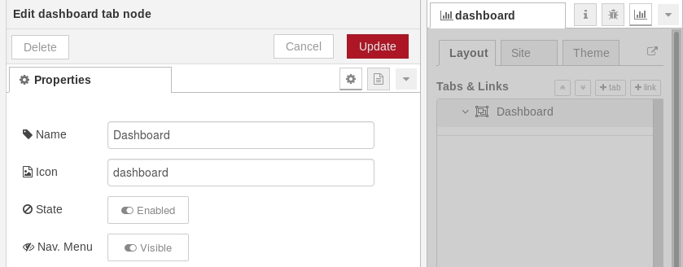

1. Add a group, which is used to collate similar widgets together, to the tab by clicking on **+group**. You need to add a total of three groups: one for the *Map*, one for *Latest tweet*, and one for *Earthquake Frequency*. When **dashboard** nodes are added, they will be added to each of these groups.

   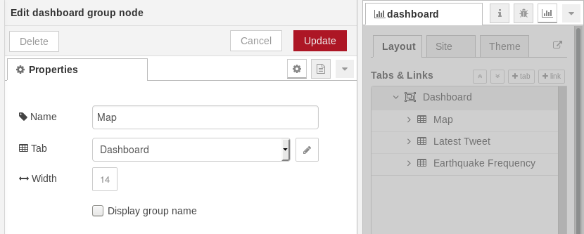

#### Define your dashboard flow

1. In the Dashboard flow editing space, add an **inject** node that will inject a payload with an empty JSON object (``{}``) once after 0.1 seconds after each deployment.
1. Add a Node-RED **template** node, and add the following HTML code, which reflects any changes in the */worldmap* end-point. Name this node `Display`.

    ```
    <iframe src="/worldmap" height=670 width=670></iframe>
    ```

1. Add a Dashboard **template** node, and edit it as follows. Call this node `Map`.

   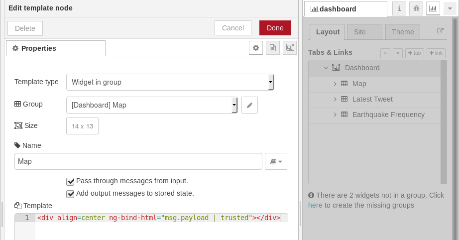

1. Add an **inject** node that will inject a payload with an empty JSON object (``{}``) 10 seconds after deployment and every 60 minutes.

   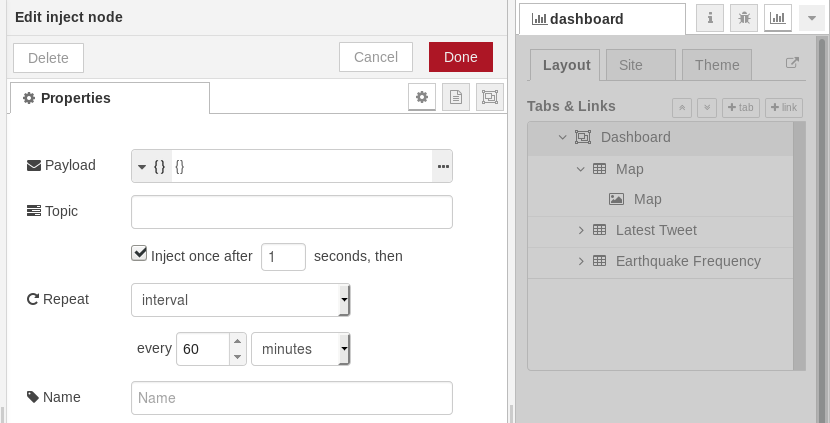

1. Connect the **inject** node to an **HTTP request** node that will call the web service we created earlier. The data that is returned will be displayed on a map through the *worldmap* endpoint, stored in a Cloudant database, and analyzed to plot a chart of earthquake frequency per area. Make sure that you edit the **HTTP request** node and replace *APPURL* with the URL of your Node-RED application. Name this node `Get Earthquake Info`.

   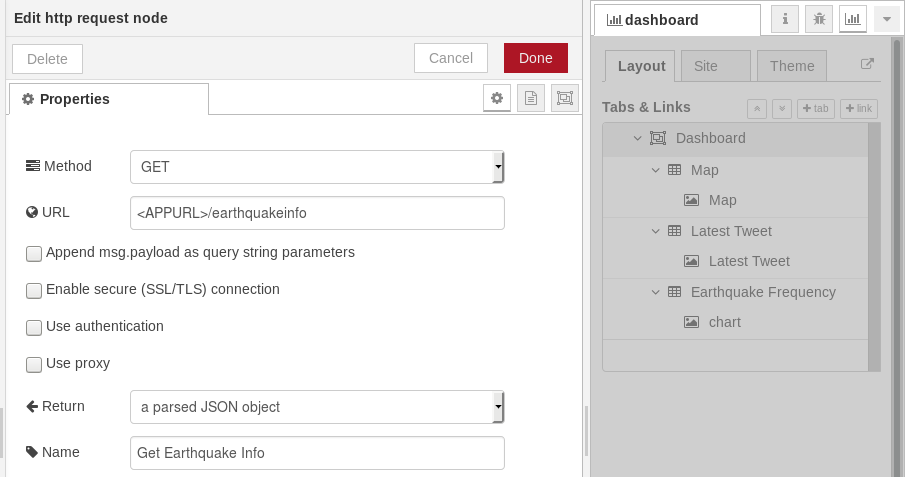

1. Connect a **split** node to the **HTTP request** node, which will split the output of returned to plot each of the point representing a location. Keep the configuration of the node as default.  Also, connect the **split** node to the **worldmap** node to plot each point on the web map and edit the node as follows.

   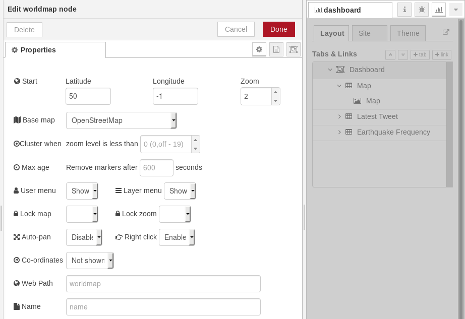

1. Since we mentioned that the point will be stored, connect a **cloudant out** node to the previously added **HTTP request** node, and configure it as shown below.

   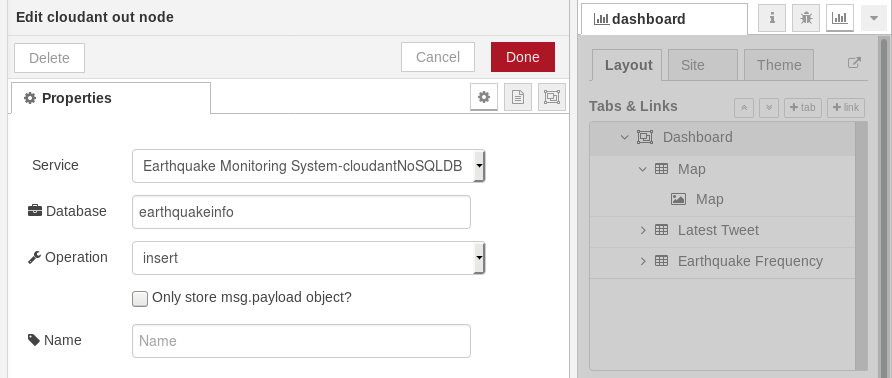

1. Now, in order to plot the line chart to look at the earthquake frequency per area, add a **change** node to the **HTTP request** node to filter out the area names. Call this node `Filter Areas`.

   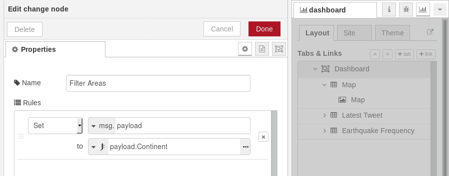

1. To the **change node**, connect a **function** node, which will be counting the number of earthquakes currently happening per area. In the **function** node, add the following javascript code. Call this node `Count`.

    ```
    var arr = msg.payload;

    var counts = {};
    for (var i = 0; i < arr.length; i++) {
        counts[arr[i]] = 1 + (counts[arr[i]] || 0);
    }

    msg.payload = counts;

    return msg;
    ```

1. Add another **function** node, which will calculate the actual frequency and will put the data in a form that can be fed into a Dashboard **chart** node. Then, modify the number of outputs coming out of the function to `11`. Name this node `Earthquake Frequency`. Use this javascript code.

    ```
    msg1 = {topic:"Australia, New-Zealand", payload:msg.payload["Australia, New-Zealand"]};
    msg2 = {topic:"Asia", payload:msg.payload.Asia};
    msg3 = {topic:"North-America", payload:msg.payload["North-America"]};
    msg4 = {topic:"South-America", payload:msg.payload["South-America"]};
    msg5 = {topic:"Europe", payload:msg.payload.Europe};
    msg6 = {topic:"Africa", payload:msg.payload.Africa};

    msg7 = {topic:"Middle-East", payload:msg.payload["Middle-East"]};
    msg8 = {topic:"Middle-America", payload:msg.payload["Middle-America"]};
    msg9 = {topic:"Indonesian Archipelago", payload:msg.payload["Indonesian Archipelago"]};
    msg10 = {topic:"Caribean Sea", payload:msg.payload["Caribean Sea"]};
    msg11 = {topic:"Pacific Ocean", payload:msg.payload["Pacific Ocean"]};

    return [msg1, msg2, msg3, msg4, msg5, msg6, msg7, msg8, msg9, msg10, msg11];
    ```

1. Connect the 11 outputs of the **function** node added in the previous step to a Dashboard **chart** node.

1. Edit the **chart** node, and set the node properties as follows.

   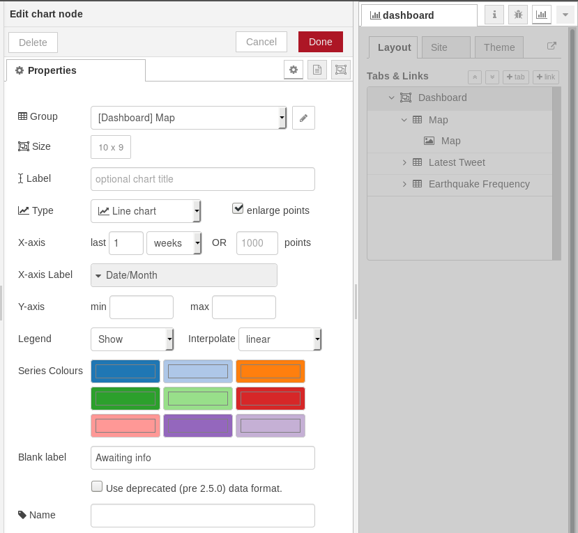

1. Add a **twitter in** node and configure the node to add **new twitter-credentials config node**. Follow the steps mentioned to obtain the consumer key and secret, and the access token and secret.

1. Search in **all public tweets** for *earthquake magnitude, earthquake hits*.

   

1. Connect the **twitter in** node to a Dashboard **text** node and configure it as follows.

   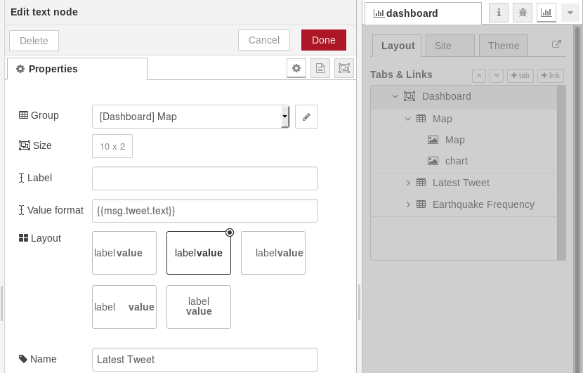

After you clean up and organize your nodes, the flow will look something like the following flow.

   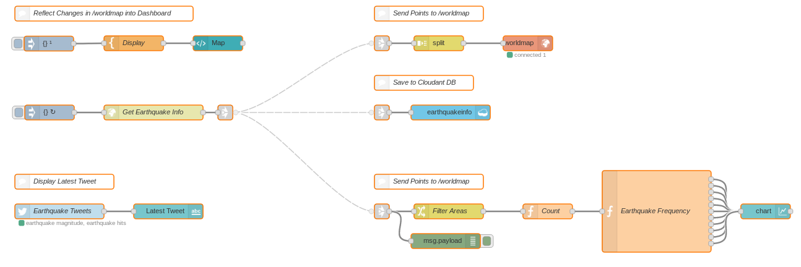

If you open the dashboard by either going to `_APPURL_/ui` or clicking on the arrow icon, you'll see something similar to the following screen capture:

   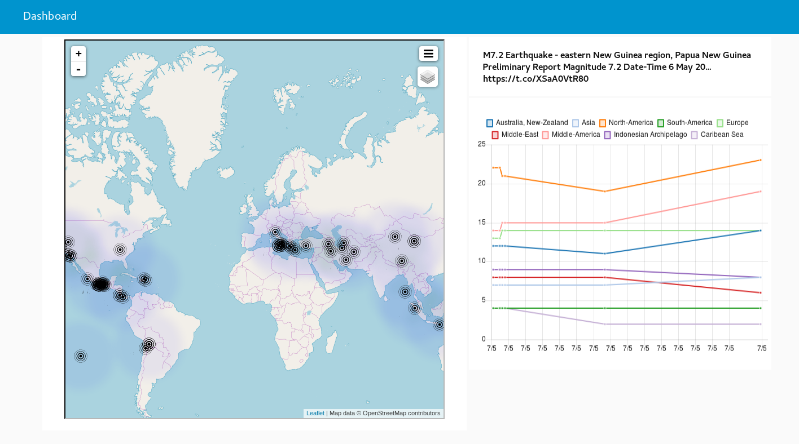

## 3 Securing Web API

While you do not have to secure your web service, it is good practice to do so.  I strongly encourage you to secure your Web API.

1. Go back to your application **Overview** page, scroll to the end of the page to find **Continuous delivery** section.
1. Click on **View toolchain**
1. Click on **Eclipse Orion Web IDE** to open the online editor.
1. Under *Edit* in the editor, go to **bluemix-setting.js** file.
1. Find the definition of the **functionGlobalContext** object.
1. Add the following javascript snippet before the **functionGlobalContext** object we added earlier to define a username and password for the API using basic authentication used to secure it.

    ```
    httpNodeAuth:{
        user: "apiUser"
        pass: ""
    }
    ```

1. Get the password using *bcrypt* by going to your flow editor, and installing **bcrypt** node via **Manage pallete**.
1. In the same flow, add and connect an **inject** node to a **bycrypt** node, which you will connect to the **debug** node.

   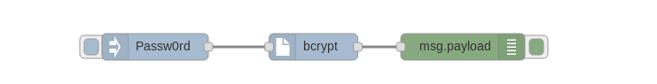

1. The **inject** will contain the password of type **string** into the **bcrypt** node (make sure the **Action** is set to **Encrypt**).
1. After injecting the password, copy the output of the **debug** node, and go back to *bluemix-setting.js* to add it to `pass` (representing the API's password during Basic Authentication).
1. Go to *Git* in the editor, and commit and push all changes.
1. Go back to the **IBM Cloud Dashboard**, and go to your application and wait for your application to finish deploying. You can check that by looking at **Delivery Pipeline**.
1. Go back to the Node-RED flow editor again to secure your API.
1. Go to the **HTTP** response node, enable **Use authentication**, select Type as **basic authentication** and enter the username and password you have defined (the password is not the output of the **bcrypt** node, but the string that was injected to the **bcrypt** node.

   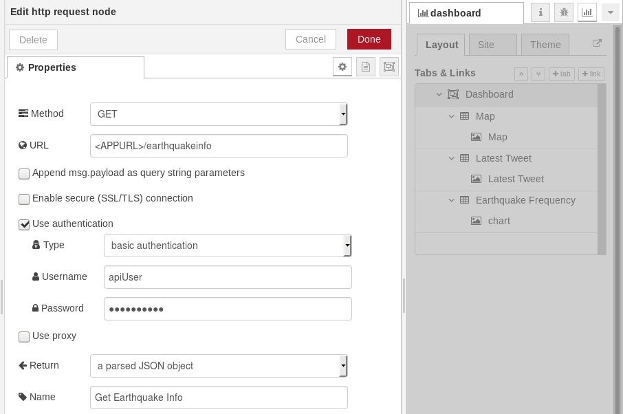

1. **Deploy** the changes.

The basic authentication will be applied to all the APIs that you define in your application.

## What to do next

Now that you have successfully implemented and deployed the application where you can monitor earthquakes in different regions, you are ready to explore the other different nodes that are available, including the **IBM Watson** node.  In particular, give this tutorial a try:  "[Build a spoken universal translator using Node-RED and Watson AI services](/tutorials/build-universal-translator-nodered-watson-ai-services/)."
