In this tutorial, you'll familiarize yourself with Node-RED, its nodes, and its flow-based programming model. You'll learn how to extend Node-RED by installing additional nodes, working with an external library, and creating dashboards. With this tutorial, you build an application that analyzes earthquake-related data along with weather data to understand when and where earthquakes are happening around the world.

[Node-RED](https://nodered.org/) is an open-source visual flow-based programming tool used for wiring not only Internet of Things (IoT) components, but also integrating an ensemble of service APIs, including ones provided by IBM Cloud. A node in Node-RED performs a particular functionality, which typically minimizes the amount of coding that is required to build a given application.  If you've never used Node-RED before, you might want to start by reviewing this brief video tutorial, "[Creating your first Node-RED flow](/videos/creating-your-first-node-red-flow/)."

Because this tutorial explores the nodes and features of Node-RED, it might not present the optimal way of developing this application. It is also worth mentioning that the application presented here was developed in a country or region where the purchase or usage of the [Weather Company Data](https://cloud.ibm.com/catalog/services/weather-company-data) for IBM Cloud service is not allowed. I encourage exploring the Weather Company Data service in case its utilization is permitted in your region.

In this tutorial, you will create a simplified Earthquake Monitoring System. The application has two main components:

* A *web service* that uses [real-time GeoJSON feeds](https://earthquake.usgs.gov/earthquakes/feed/v1.0/geojson.php) from the USGS Earthquake Hazard Program for displaying earthquake information every hour. Based on the location coordinates (longitude & latitude) of a given earthquake point, the current weather conditions are retrieved using an [OpenWeatherMap](https://home.openweathermap.org/).

* A *dashboard* that displays the earthquake points retrieved from the web service component, whose details are also saved in a Cloudant database, onto a world map. Additionally, the latest earthquake-related tweets, as well as the frequency of the earthquakes happening in each region, are presented.

So let's get started!

## Learning objectives

After you complete this tutorial, you will know how to:

* Create a Node-RED Starter application running on IBM Cloud.
* Install and work with nodes available in the [Node-RED Library](https://flows.nodered.org/).
* Make external packages or modules available to a **function** node.
* Work with **Dashboard** nodes.
* Secure a Web API that was created in a Node-RED Starter application.

## Prerequisites

* Create an  [IBM Cloud](https://cloud.ibm.com) **lite** account, if you don't already have one.
* Create an account on [**OpenWeatherMap**](https://home.openweathermap.org) to retrieve an API key
* Create an account on [**Twitter**](https://twitter.com/) and [create a Twitter application](http://apps.twitter.com/)

## Estimated time

It will take about 1 hour to complete this tutorial, including the prerequisites.

## 1 Create a Node-RED Starter Application

1. Log in to your [IBM Cloud](https://cloud.ibm.com) account.
1. Open the IBM Cloud [Catalog](https://cloud.ibm.com/catalog).
1. Select the [**Starter Kits**](https://cloud.ibm.com/catalog?category=starterkits) category, then click [**Node-RED Starter**](https://cloud.ibm.com/catalog/starters/node-red-starter).
1. Enter a unique name for the app. This name is also used as the hostname. If you are using a lite account, the Region, Organization, and Space fields are pre-populated with the appropriate values.
1. In the **Selected Plan** section, for the Cloudant database, choose the **Lite** option.
1. Click the **Create** button.

   

1. After the status of your application changes to `Running`, click **Visit App URL**.
1. Follow the directions to access the *Node-RED flow editor*. You are encouraged to secure your Node-RED flow editor to ensure that only authorized users can access it.

   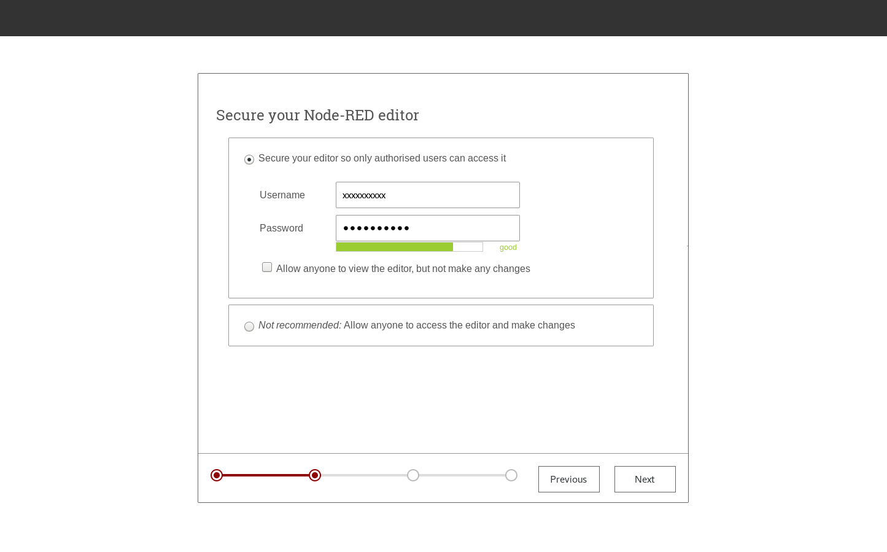

1. Click on **Go to your Node-RED flow editor**. A new flow called `Flow 1` is opened in the Node-RED flow editor. If you secured your Node-RED flow editor, you will first be asked to enter the **username** and **password** that you just set up.

## 2 Develop the Application

Our Earthquake Monitoring System application has two main components:

* The *web service* component
* The *dashboard* component

The steps to create these two components in our Node-RED app follow. I encourage you to follow the steps to learn just how easy it is to create apps using Node-RED.

You can also import both of the flows explained in this tutorial. First, download or copy the contents of the [flows.json file](static/flows.json) to the clipboard. Then, go to the hamburger menu in your Node-RED editor, and select **Import > Clipboard**. Then, paste the contents into the dialog, and click **Import**. In case you selected to download the file, make sure to select **select a file to import**, then click **Import**. You'll still need to follow the steps in this tutorial to configure all the nodes and to make a package available to a **function** node.

### 2a Create the Web Service

1. Double-click the tab with the flow name, and call it `Earthquake Details`.
1. Click the hamburger menu, and then click **Manage palette**. Look for **node-red-node-openweathermap** to install these additional nodes in your palette.

   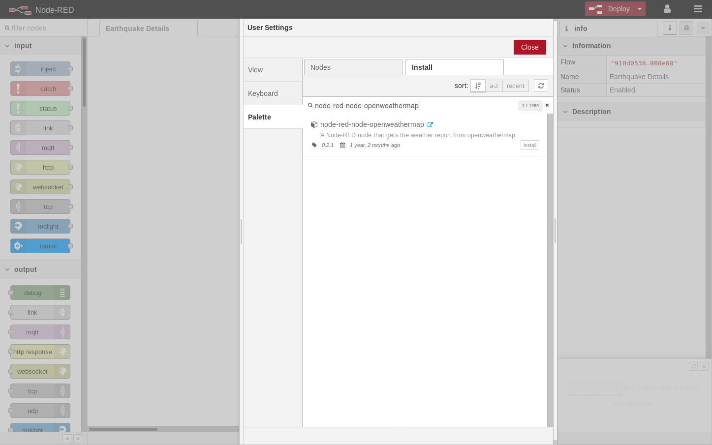

1. Add an **HTTP input** node to your flow.
1. Double-click the node to edit it. Set the method to `GET` and set the URL to `/earthquakeinfo-hr`.
1. Add an **HTTP response** node, and connect it to the previously added **HTTP input** node. All other nodes introduced in this sub-section is to be added between the **HTTP input** node and the **HTTP response** node.
1. Add an **HTTP request** node and set the *URL* to `https://earthquake.usgs.gov/earthquakes/feed/v1.0/summary/all_hour.geojson`, the *Method* to **GET** and the *Return* to **a parsed JSON object**. This will allow extracting all earthquakes that occurred within the last hour. Name this node `Get Earthquake Info from USGS`.

   

1. Add a **change** node. Double-click the node to modify it. Name this node `Set Earthquake Info`. In the **Rules** section, add rules to *Delete* `msg.topic`, `msg.headers`, `msg.statusCode`, `msg.responseUrl` and `msg.redirectList` and *Set* `msg.payload` to the following JSONata expression.

   ```
   payload.features.{
      "type":properties.type,
      "magnitude": properties.mag,
      "location": properties.place,
      "longitude":geometry.coordinates[0],
      "latitude":geometry.coordinates[1],
      "depth":geometry.coordinates[2],
      "timestamp": $fromMillis(
          properties.time,
          '[H01]:[m01]:[s01] [z]',
          '+0400'
      ),
      "source": properties.net
   }
   ```

1. Add a **split** node, which will split the earthquake information points into different messages based on the location.
1. Add a **change** node to set the longitude and latitude to the right properties, which will get fed into the **openweathermap** node. In the **Rules** section, you will *Set* `msg.details` to `msg.payload`, `msg.location.lon` to `msg.payload.longitude`, and `msg.location.lat` to `msg.payload.latitude`.Name this node `Set Lon & Lat`.

   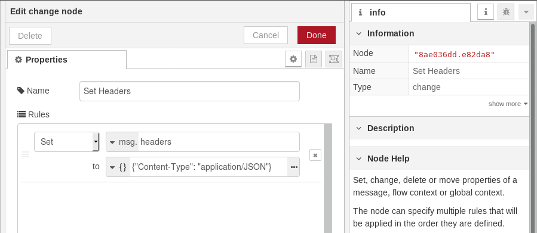

1. Add an **openwethermap** node to which you will be adding the API key from the [OpenWeatherMap site](https://home.openweathermap.org/api_keys). (Log in to the site with the account you created.)
1. Add another **change node** that will *Set* the `msg.payload` to the output of a JSONata expression that will format the messages correctly. Name the node `Add Weather Data`. The JSONata expression is as follows.

   ```
    msg.{
      "name": parts.index,
      "Place": details.place,
      "Location":details.location,
      "Country":location.country,
      "mag":details.magnitude,
      "Source":details.source,
      "Timestamp":details.timestamp,
      "lon": location.lon,
      "lat":location.lat,
      "Type":details.type,
      "Temperature":data.main.temp & ' Kelvin',
      "Pressure":data.main.pressure & ' hPa',
      "Humidity":data.main.humidity & ' %',
      "Wind Speed":data.wind.speed & ' meter(s)/sec',
      "Wind Direction":data.wind.deg & ' degree(s)',
      "Cloud Coverage":data.clouds.all & ' %',
      "icon":'earthquake',
      "intensity":details.magnitude / 10 
   }
   ```

1. Click **Deploy** for all changes to take effect.

#### Adding the **countryjs** Package

Before being able to finish the *web service* component, you need to make the [**countryjs**](https://www.npmjs.com/package/countryjs) package available to the **function** node, which will allow us to set the region and country per earthquake point.

1. Go back to the IBM Cloud application that you created.
1. Click **Overview**.  In the **Continuous delivery** section, click **Enable**.

   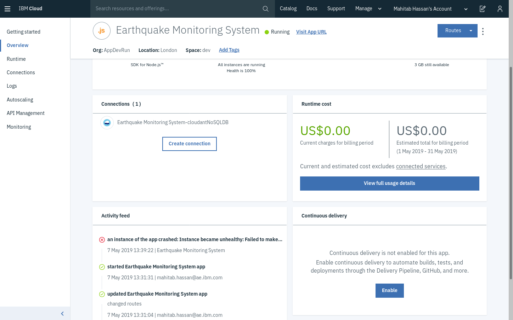

1. Confirm all the pre-populated details. Then, under **Tool Integrations**, select **Delivery Pipeline**, and then click **Create+** to generate an IBM Cloud API Key.
1. At the bottom of the page, click the **Create** button.

   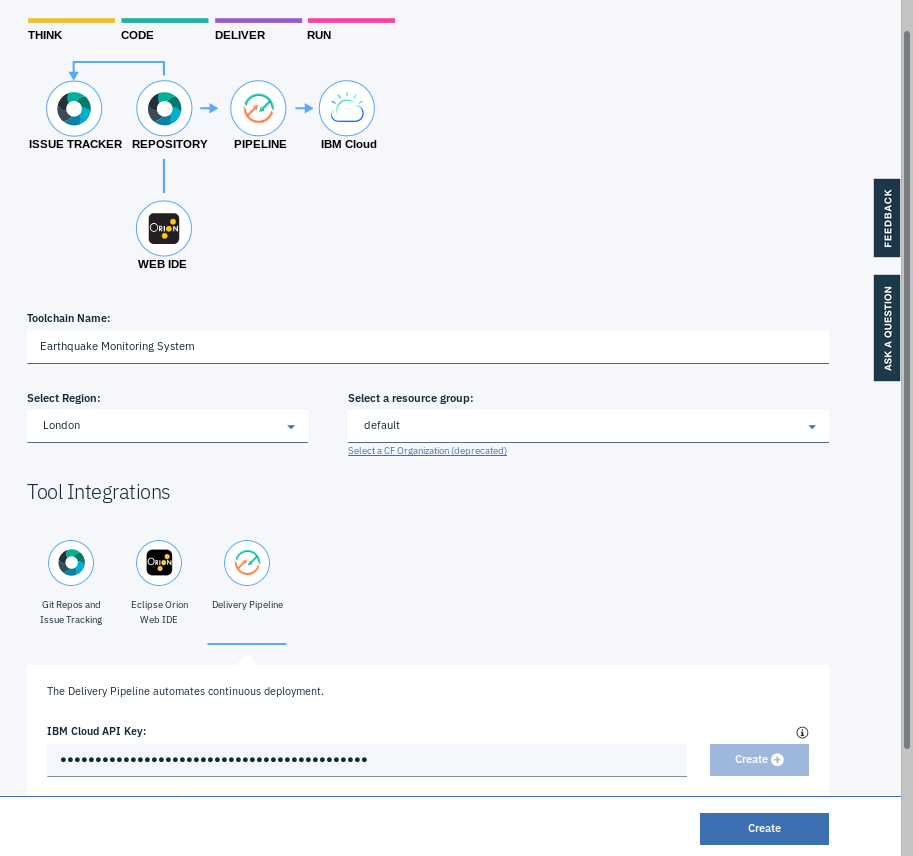

1. Now, you need to configure the files to make the countryjs package available to the **function** node.  In the Toolchains window, do one of the following steps:

    * Clone the repository from the **Git** action, and make the edits to the files locally.
    * Open the Eclipse Orion Web IDE to edit the files in the IBM Cloud.

   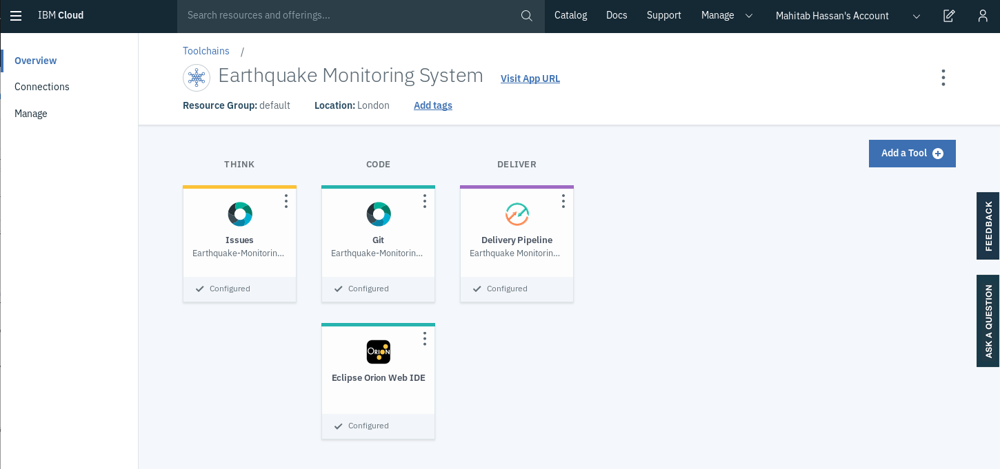

1. Edit the `bluemix-settings.js` file.

   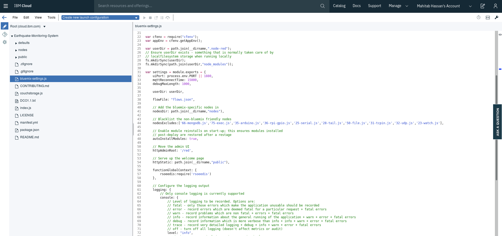

1. Find the definition of the `functionGlobalContext` object, and add `countryjs`.

    ```
    functionGlobalContext: {
        countryjs:require('countryjs')
    },
    ```

1. Edit the `package.json` file, and define `countryjs` as a dependency.

    ```
    "dependencies": {
        ...,
        "countryjs":"1.8.0"
    },
    ```

   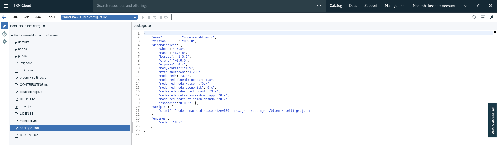

1. Use Git to commit and push all changes.

1. Go back to your application, and wait for your application to finish deploying. You can check that by looking at the **Delivery Pipeline** card.

   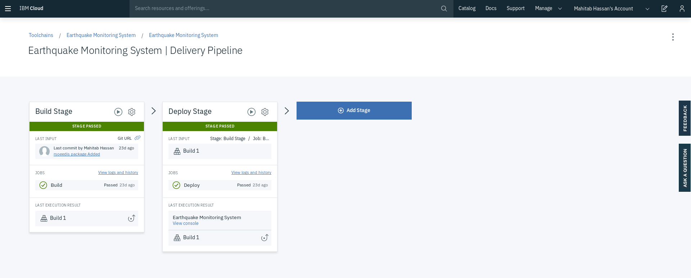

#### Finishing the Web Service

1. Add a **function** node after the **change** node that you previously added.  Name the function node `Set Region & Country using countryjs`. Add the following javascript code to the node.

   ```
   var countryjs = global.get('countryjs');

   msg.payload.Country = countryjs.name(msg.location.country)
   msg.payload.Region = countryjs.region(msg.location.country)

   return msg;
   ```

1. Add a **change** node to remove any redundant properties. In the **Rules** section, add rules to *Delete* `msg.details`, `msg.location`, `msg.data`, `msg.title` and `msg.description`. Name this node `Remove Unnecessary Properties`.

   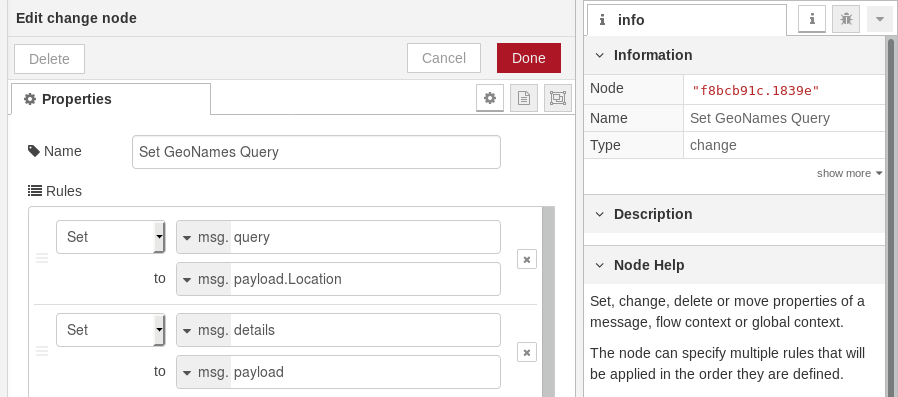
   
1. Add a **join** node to join the previous split message into a single one again, which will be returned when an HTTP request is submitted.
1. Add a **change** node and name it `Set Headers`. In the **Rules** section, add a rule to *Set* `msg.headers` to `{ "Content-Type": "application/JSON" }` to define that HTTP request to the *web service* will be returned in a JSON format.
1. After cleaning up the flow, your flow should look similar to the following.

   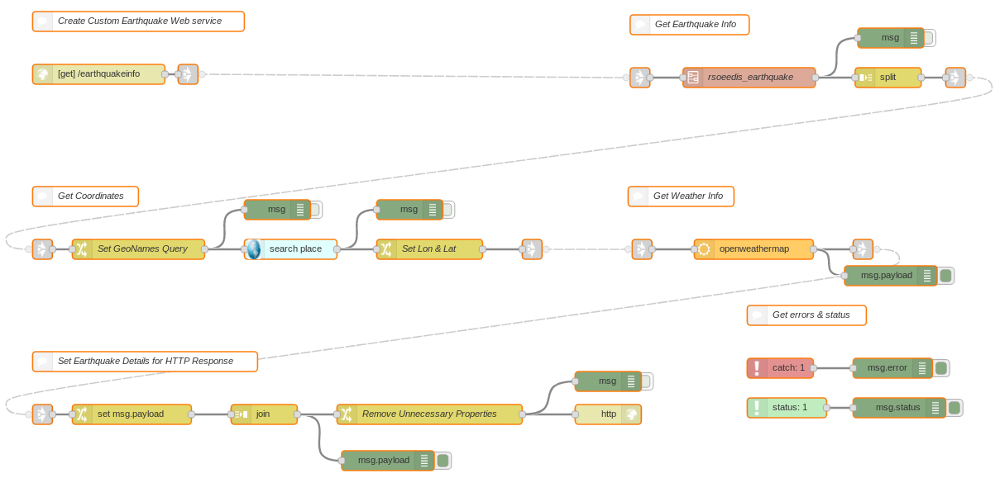

1. Click **Deploy** for all changes to take effect.


### 2b Creating the Dashboard

Now that you've created the *web service* component, you can create the Dashboard component.

#### Group similar widgets together in your dashboard

1. Add a new flow, and name it `Dashboard`.
1. Go to **Manage palette**, and install the **node-red-contrib-web-worldmap** and **node-red-dashboard** packages. **node-red-contrib-web-worldmap** is used to create a map on which points corresponding to locations where earthquakes are taking place in the last 1 hour are plotted. **node-red-dashboard** is used to display the latest earthquake-related tweets and the frequency of earthquakes per region.
1. Go to the **Dashboard** tab that was added next to the **Node information** and **Debug messages** tabs. There are three sub-tabs: **Layout**, **Site** and **Theme**. Each of these sub-tabs is used to change the look and feel of the UI.
1. Under **Layout**, create a tab by clicking on **+tab**, which can resemble a page in the UI. Edit it as shown in the following image, and click **Update**.

   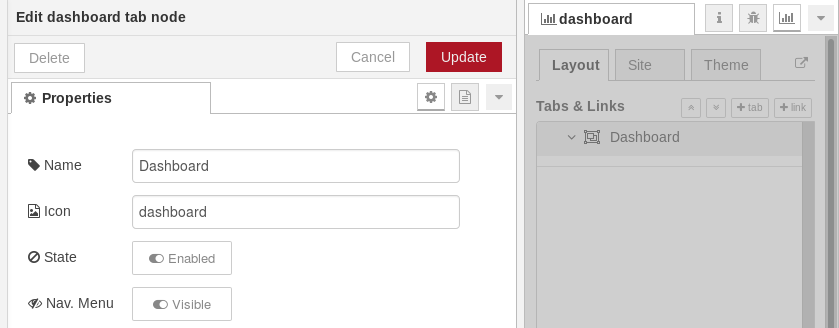

1. Add a group, which is used to collate similar widgets together, to the tab by clicking on **+group**. You need to add a total of three groups: one for the *Map*, one for *Latest tweet*, and one for *Earthquake Frequency*. When **dashboard** nodes are added, they will be added to one of these groups.

   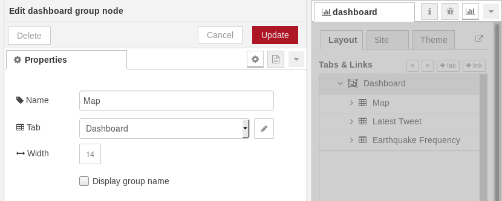

#### Define your dashboard flow

1. In the Dashboard flow editing space, add an **inject** node that will inject a payload with an empty JSON object (`{}`) once after *0.1* seconds after each deployment.
1. Add a Node-RED **template** node, and add the following HTML code, which reflects any changes in the `/worldmap` end-point. Name this node `Display`.

    ```
    <iframe src="/worldmap" height=670 width=670></iframe>
    ```

1. Add a Dashboard **template** node, and edit it as follows. Call this node `Map`.

   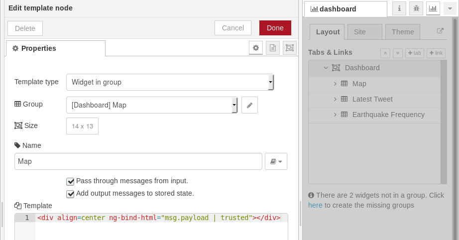

1. Add an **inject** node that will inject a payload with an empty JSON object (`{}`) *5* seconds after deployment and every *60* minutes.

   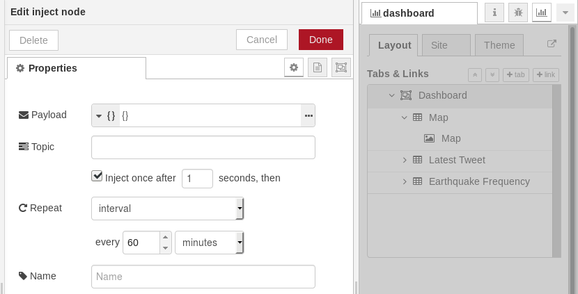

1. Connect the **inject** node to an **HTTP request** node that will call the web service we created earlier. The data that is returned will be displayed on a map through the *worldmap* endpoint, stored in a Cloudant database, and analyzed to plot a chart of earthquake frequency per region. Make sure that you edit the **HTTP request** node and replace <*APPURL*> with the URL of your Node-RED application and have *Return* set to **a parsed JSON object**. Name this node `Get Earthquake Info`.

   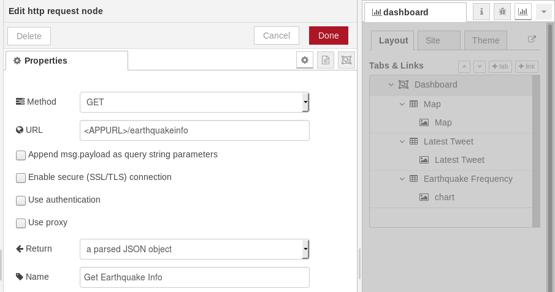

1. Connect a **split** node to the **HTTP request** node, which will split the output of returned to plot each of the point representing a location. Keep the configuration of the node as default.  Also, connect the **split** node to the **worldmap** node to plot each point on the web map and edit the node as follows.

   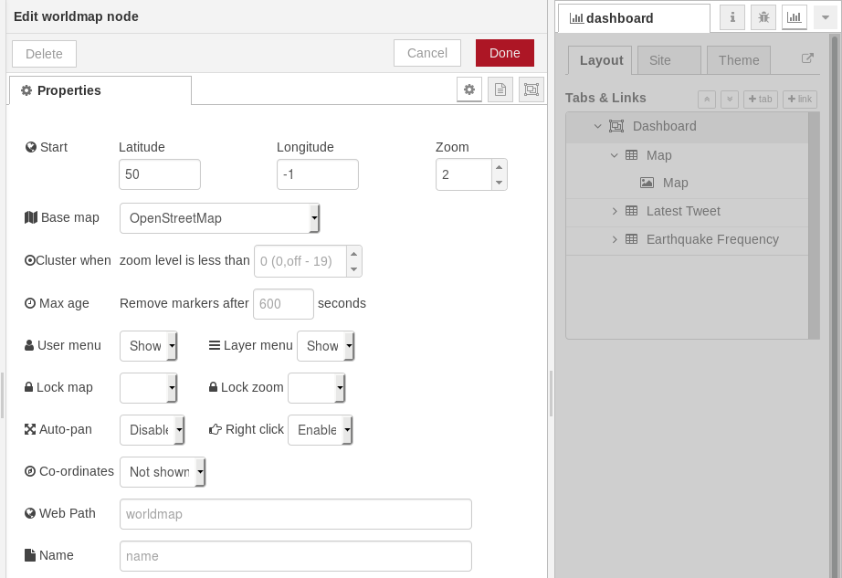

1. Since we mentioned that the points will be stored, connect a **cloudant out** node to the previously added **HTTP request** node, and configure it as shown below.

   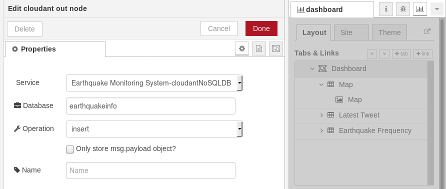

1. Now, in order to plot the line chart to look at the earthquake frequency per region, add a **change** node to the **HTTP request** node to filter out the region names. Add a rule to *Set* `msg.payload` to the JSONata expression `payload.Region`. Call this node `Filter Regions`.

   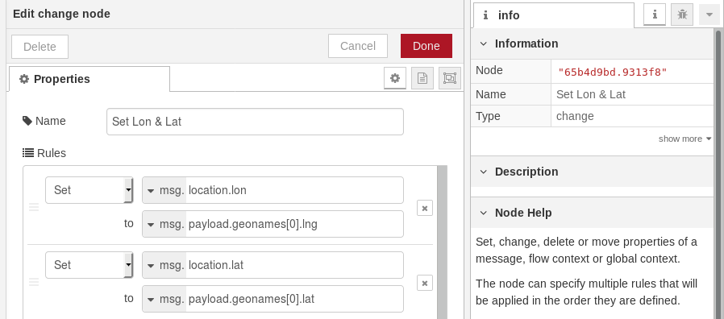

1. To the **change node**, connect a **function** node, which will be counting the number of earthquakes currently happening per region. In the **function** node, add the following javascript code. Call this node `Count`.

   ```
   var arr = msg.payload;

   var counts = {};
   for (var i = 0; i < arr.length; i++) {
       counts[arr[i]] = 1 + (counts[arr[i]] || 0);
   }

   msg.payload = counts;

   return msg;
   ```

1. Add another **function** node, which will calculate the actual frequency and will put the data in a form that can be fed into a Dashboard **chart** node. Then, modify the number of outputs coming out of the function to `5`. Name this node `Earthquake Frequency`. Use this javascript code.

   ```
   msg1 = {topic:"Africa", payload:msg.payload.Africa};
   msg2 = {topic:"Americas", payload:msg.payload.Americas};
   msg3 = {topic:"Asia", payload:msg.payload.Asia};
   msg4 = {topic:"Europe", payload:msg.payload.Europe};
   msg5 = {topic:"Oceania", payload:msg.payload.Oceania};

   return [msg1, msg2, msg3, msg4, msg5];
   ```

1. Connect the 5 outputs of the **function** node added in the previous step to a Dashboard **chart** node.

1. Edit the **chart** node, and set the node properties as follows.

   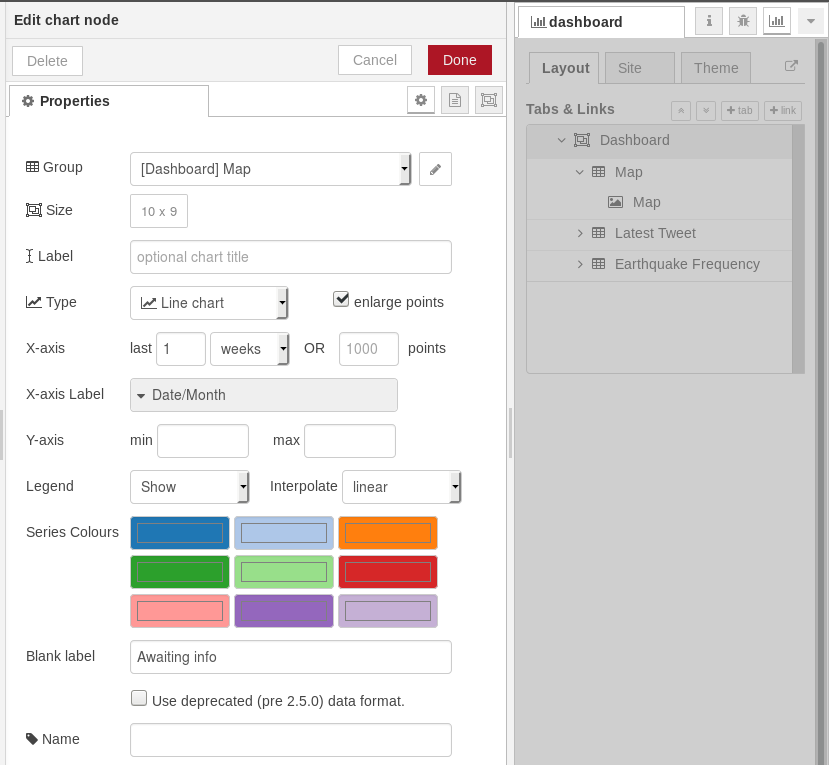

1. Add a **twitter in** node and configure the node to add **new twitter-credentials config node**. Follow the steps mentioned to obtain the consumer key and secret, and the access token and secret.

1. Search in **all public tweets** for *earthquake magnitude, earthquake hits*.

   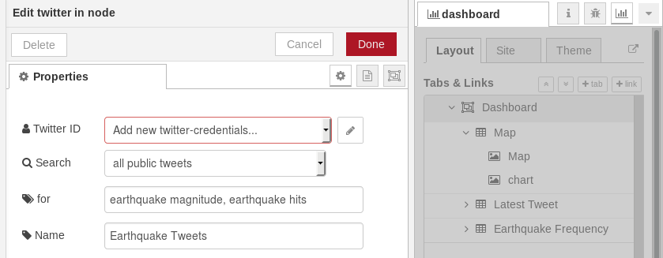

1. Connect the **twitter in** node to a Dashboard **text** node and configure it as follows.

   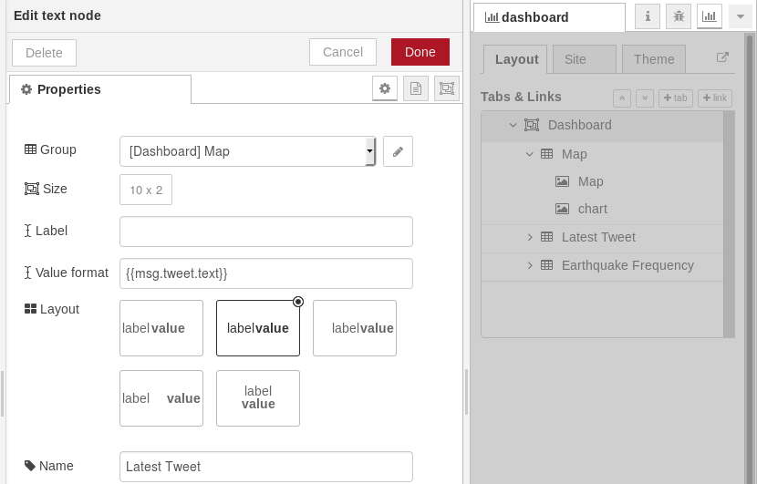

After you clean up and organize your nodes, the flow will look something similar to the following.

   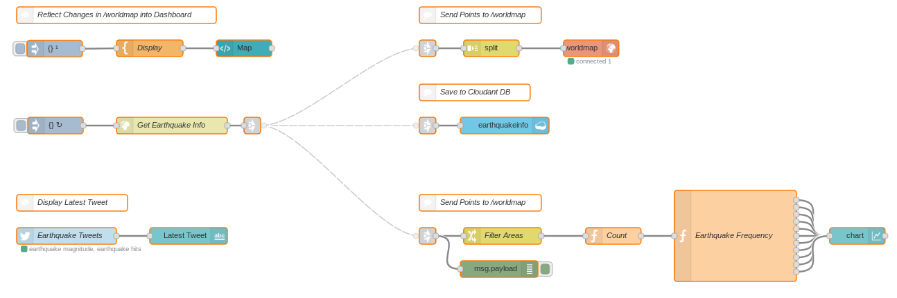

If you open the dashboard by either going to `_APPURL_/ui` or clicking on the arrow icon, you'll see something similar to the following screen capture:

   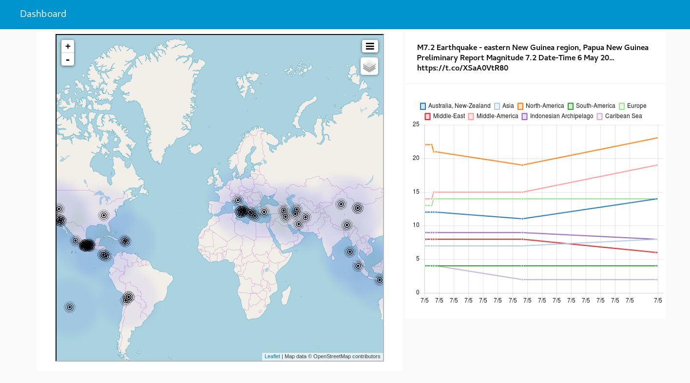

## 3 Securing Web API

While you do not have to secure your web service, it is good practice to do so.  I strongly encourage you to secure your Web APIs.

1. Go back to your application **Overview** page, scroll to the end of the page to find **Continuous delivery** section.
1. Click on **View toolchain**
1. Click on **Eclipse Orion Web IDE** to open the online editor.
1. Under *Edit* in the editor, go to **bluemix-setting.js** file.
1. Find the definition of the **functionGlobalContext** object.
1. Add the following javascript snippet before the **functionGlobalContext** object we added earlier to define a username and password for the API using basic authentication used to secure it.

    ```
    httpNodeAuth:{
        user: "apiUser"
        pass: ""
    }
    ```

1. Get the password using *bcrypt* by going to your flow editor, and installing **bcrypt** node via **Manage pallete**.
1. In the same flow, add and connect an **inject** node to a **bycrypt** node, which you will connect to the **debug** node.

   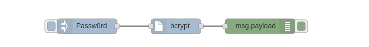

1. The **inject** will contain the password of type **string** into the **bcrypt** node (make sure the **Action** is set to **Encrypt**).
1. After injecting the password, copy the output of the **debug** node, and go back to *bluemix-setting.js* to add it to `pass` (representing the API's password during Basic Authentication).
1. Go to *Git* in the editor, and commit and push all changes.
1. Go back to the **IBM Cloud Dashboard**, and go to your application and wait for your application to finish deploying. You can check that by looking at **Delivery Pipeline**.
1. Go back to the Node-RED flow editor again to secure your API.
1. Go to the **HTTP** response node, enable **Use authentication**, select Type as **basic authentication** and enter the username and password you have defined (the password is not the output of the **bcrypt** node, but the string that was injected to the **bcrypt** node.

   

1. **Deploy** the changes.

The basic authentication will be applied to all the APIs that you define in your application.

## What to do next

Now that you have successfully implemented and deployed the application where you can monitor earthquakes in different regions, you are ready to explore the other different nodes that are available, including the **IBM Watson** nodes.  In particular, give this tutorial a try:  "[Build a spoken universal translator using Node-RED and Watson AI services](/tutorials/build-universal-translator-nodered-watson-ai-services/)."
